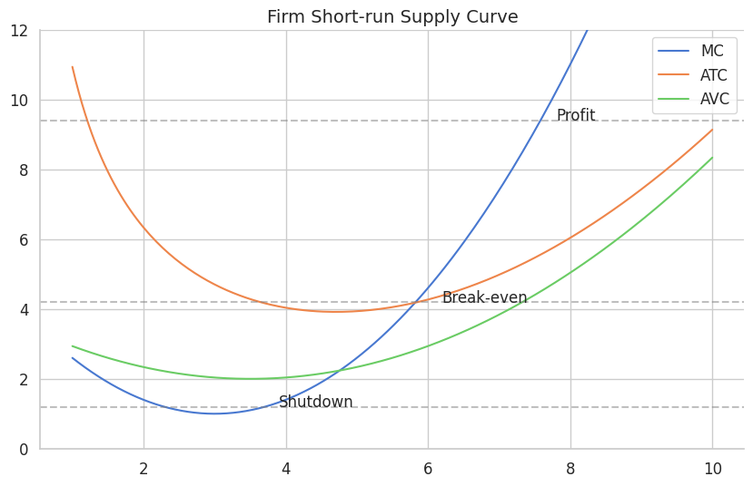
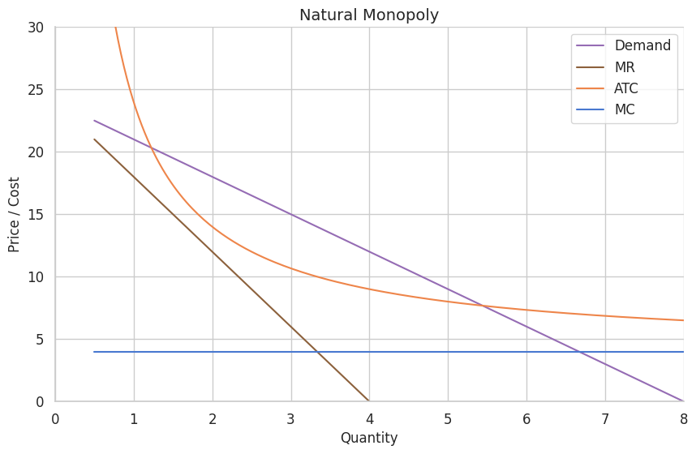
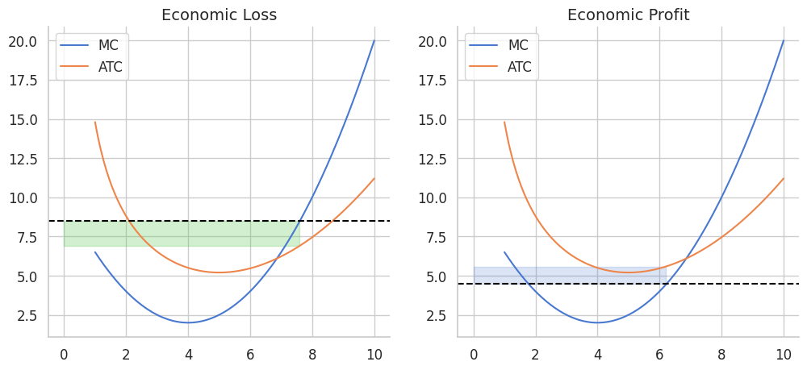

# AP Microeconomics

*High-difficulty concepts and logic-heavy modules. Optimized for quick reference before exams.*

---

## I. Basic Concepts

- **Economics**: The study of how societies allocate scarce resources to produce and distribute goods.
- **Macroeconomics**: Overall economic performance — inflation, GDP, unemployment.
- **Microeconomics**: Behavior of individual entities — firms and households.
- **Positive Economics**: Describes facts. *"What is."*
- **Normative Economics**: Involves value judgments. *"What ought to be."*

### Scarcity & Opportunity Cost

- **Scarcity**: Limited resources (`Land`, `Labor`, `Capital`, `Entrepreneurship`) cannot meet unlimited wants.
- **Opportunity Cost**: The value of the next best alternative foregone.

---

## II. Economic Systems & Models

### The Three Fundamental Questions

1. **What** to produce?
2. **How** to produce?
3. **For whom** to produce?

### Circular Flow Model

- **Product Market**: Households are buyers; Firms are sellers.
- **Factor Market**: Firms are buyers; Households are sellers.

---

## III. Utility & Elasticity

### Utility Maximizing Rule

A rational consumer allocates income so the last dollar spent on each good yields equal Marginal Utility:

$$\frac{MU_x}{P_x} = \frac{MU_y}{P_y}$$

### Elasticity Formulas

| Type | Formula | Key Logic |
| :--- | :--- | :--- |
| **PED** | %ΔQd / %ΔP | > 1 Elastic · = 1 Unit Elastic (TR is max) |
| **PES** | %ΔQs / %ΔP | Seller responsiveness to price changes |
| **YED** | %ΔQd / %ΔIncome | > 0 Normal Good · < 0 Inferior Good |
| **XED** | %ΔQdA / %ΔPb | > 0 Substitutes · < 0 Complements |

---

## IV. Product Market Efficiency

### Productive Efficiency

*"How to produce."* Production occurs at the lowest possible cost.

$$P = \min ATC$$

At this point resources are used with zero waste. In the long run, perfectly competitive firms are forced here.

### Allocative Efficiency

*"What to produce."* Resources yield the mix of goods most wanted by society.

$$P = MC$$

- **Price ($P$)** represents **Marginal Benefit** — the value society places on the last unit.
- **Marginal Cost ($MC$)** represents **Opportunity Cost** — the value of alternatives sacrificed.

| Condition | Meaning | Implication |
| :--- | :--- | :--- |
| $P > MC$ | Under-allocation | MB > MC; increase output (common in monopoly) |
| $P < MC$ | Over-allocation | MB < MC; reduce output |

---

## V. Market Structures

### Natural Monopoly

Continuous economies of scale — ATC is a downward slope.

$$ATC = \frac{TFC}{Q} + AVC$$

| Regulation | Rule | Result |
| :--- | :--- | :--- |
| **Unregulated** | $MR = MC$ | Profit max; highest price; large DWL |
| **Fair Return** | $P = ATC$ | Normal profit (break-even) |
| **Socially Optimal** | $P = MC$ | Allocative efficiency; firm runs at a loss |

### Monopolistic Competition

- **Short Run**: Behaves like a monopoly — profit or loss.
- **Long Run**: Entry/exit shifts demand until $P = ATC$ (tangent point).
- **Inefficiency**: Always has excess capacity (not at min $ATC$) and $P > MC$.

---

## VI. Factor Market

### Hiring Rule

A firm hires until:

$$MRP = MFC$$

- **MRP** (Marginal Revenue Product): $MP \times P$ — the benefit of one more unit of labor.
- **MFC** (Marginal Factor Cost): $\Delta TC / \Delta L$ — the cost of one more unit of labor.

### Monopsony

Single buyer of labor. $MFC >$ Supply (Wage) because hiring one more worker raises the wage for *all* workers.

**Decision**: Find $Q$ where $MRP = MFC$, then trace down to the supply curve for the wage.

### Least-Cost Combination

$$\frac{MP_L}{P_L} = \frac{MP_K}{P_K}$$

---

## VII. Market Failures & Externalities

| Type | Condition | Problem | Solution |
| :--- | :--- | :--- | :--- |
| **Positive Externality** | $MSB > MPB$ | Under-allocation | Subsidy |
| **Negative Externality** | $MSC > MPC$ | Over-allocation | Tax |

---

Source Code

[graphs.ipynb ↗](https://github.com/asong56/Me.archive/blob/main/lib/ap-econ-micro/graphs.ipynb ':target=_blank')

