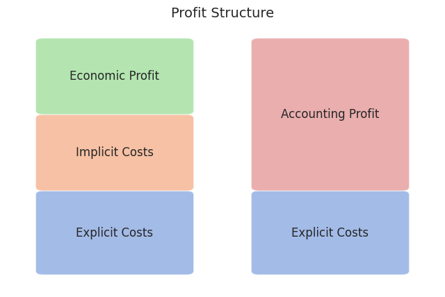
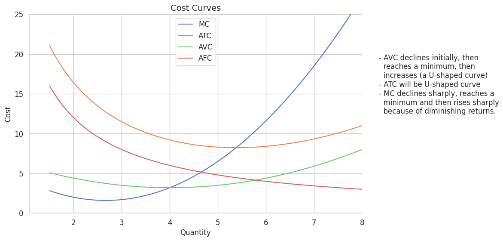
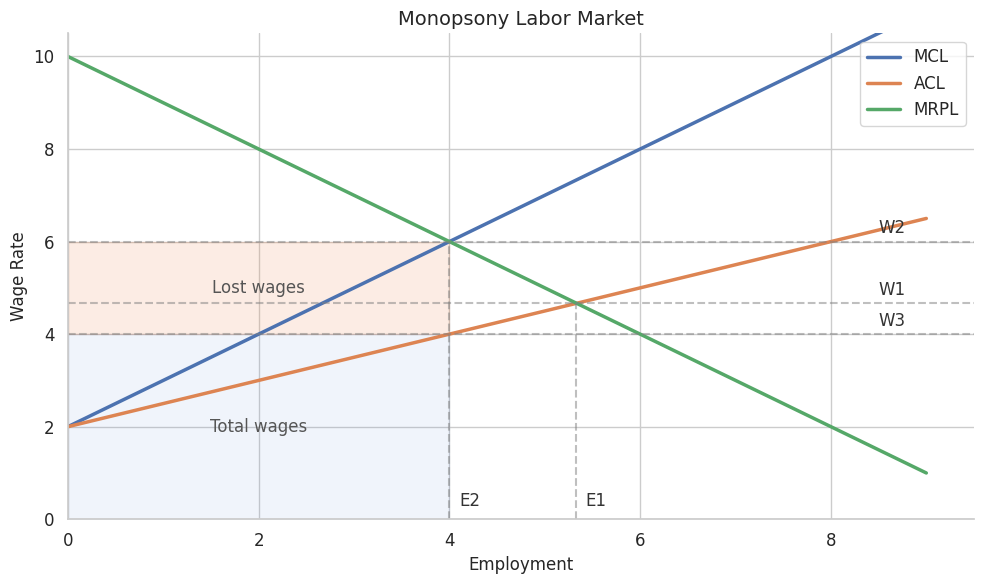

# AP Microecon Review Notes

> **Note:** This document focuses on high-difficulty concepts and logic-heavy modules. Optimized for quick reference before exams.

---

## 1. Basic Concepts

* **Economics**: The study of how societies use **scarce resources** to produce valuable commodities and distribute them among different people.
* **Macroeconomics**: Focuses on overall performance (Inflation, GDP, Unemployment).
* **Microeconomics**: Focuses on the behavior of **individual entities** (Firms and Households).
* **Positive Economics**: Collects and presents facts—*"What is."*
* **Normative Economics**: Involves value judgments—*"What ought to be."*

### 1.1 Scarcity & Opportunity Cost
* **Scarcity**: Occurs when limited resources (`Land`, `Labor`, `Capital`, `Entrepreneurship`) cannot meet unlimited human wants.
* **Opportunity Cost**: The value of the **next best alternative** foregone.

---

## 2. Economic Systems & Models

### 2.1 The Three Fundamental Questions
1.  **What** to produce?
2.  **How** to produce?
3.  **For whom** to produce?

### 2.2 Circular Flow Model
* **Product Market**: Households are buyers; Firms are sellers.
* **Factor Market**: Firms are buyers; Households are sellers.

---

## 3. Utility & Elasticity

### 3.1 Utility Maximizing Rule
A rational consumer allocates income such that the last dollar spent on each product yields the same **Marginal Utility (MU)**.
$$\frac{MU_x}{P_x} = \frac{MU_y}{P_y}$$

### 3.2 Elasticity Formulas

| Type | Formula | Key Logic |
| :--- | :--- | :--- |
| **PED** | %ΔQd / %ΔP | If > 1, Elastic; if = 1, Unit Elastic (TR is max). |
| **PES** | %ΔQs / %ΔP | Measures seller responsiveness to price changes. |
| **YED** | %ΔQd / %ΔIncome | > 0: **Normal Good**; < 0: **Inferior Good**. |
| **XED** | %ΔQdA / %ΔPB | > 0: **Substitutes**; < 0: **Complements**. |

---

## 4. Product Market Efficiency

### 4.1 Productive Efficiency
* **Core Concept**: "How to produce." Focuses on minimizing waste and costs.
* **Definition**: Production occurs in the least costly way. Firms must use the best available technology and optimal resource mix to survive.
* **Efficiency State**: $$P = \text{minimum } ATC$$

* **Implication**: At this point, resources are used to their absolute limit with zero waste. In the long run, perfectly competitive firms are forced to achieve this.

### 4.2 Allocative Efficiency (Difficulty Analysis)
* **Core Concept**: "What to produce." Focuses on matching production with consumer desires.
* **Definition**: Resources are distributed among firms and industries to yield the mix of products most wanted by society.
* **The Logic of P and MC**:
    * **Price ($P$)**: Represents the **Marginal Benefit ($MB$)**—the value society places on the last unit produced.
    * **Marginal Cost ($MC$)**: Represents the **Opportunity Cost**—the value of alternative goods sacrificed to produce this unit.
* **Efficiency State**: $$P = MC$$
* **Analysis of Inefficiency**:
    1. **Under-allocation ($P > MC$)**: Society values the next unit more than the cost of resources used ($MB > MC$). Output is too low; increasing production increases social welfare. (Common in Monopolies).
    2. **Over-allocation ($P < MC$)**: The cost of resources exceeds the value society gets from the product ($MB < MC$).

Society is sacrificing more valuable goods for less valuable ones; production should be reduced.

---

## 5. Market Structures

### 5.1 Natural Monopoly
* **Condition**: Continuous **Economies of Scale**. $ATC$ is a downward "slide."
* **Rule**: $ATC = \frac{TFC}{Q} + AVC$

| Regulation Point | Rule | Result |
| :--- | :--- | :--- |
| **Unregulated** | $MR = MC$ | Profit Max; Highest Price; Massive $DWL$. |
| **Fair Return** | $P = ATC$ | Normal Profit (Break-even). Common regulation. |
| **Socially Optimal** | $P = MC$ | Allocative Efficiency. Firm suffers loss ($P < ATC$). |

### 5.2 Monopolistic Competition
* **Short Run**: Looks like Monopoly (Profit or Loss).
* **Long Run**: Entry/Exit shifts $D$ until $P = ATC$ (Tangent point).
* **Inefficiency**: Always has **Excess Capacity** (doesn't produce at min $ATC$) and is not allocatively efficient ($P > MC$).

---

## 6. Factor Market

### 6.1 Hiring Rule
A firm hires resources until:
$$MRP = MFC$$
* **MRP (Marginal Revenue Product)**: $MP \times P$ (The benefit).
* **MFC (Marginal Factor Cost)**: $\Delta TC / \Delta L$ (The cost).

### 6.2 Monopsony
* **Feature**: $MFC > \text{Supply (Wage)}$.
* **Logic**: To hire one more worker, the firm must raise the wage for **all** workers.
* **Decision**: Find $Q$ where $MRP = MFC$, then go down to the **Supply curve** to find the Wage.

### 6.3 Least-Cost Combination
$$\frac{MP_L}{P_L} = \frac{MP_K}{P_K}$$

---

## 7. Market Failures & Externalities
* **Positive Externality**: $MSB > MPB$. Under-allocation. Solution: **Subsidy**.
* **Negative Externality**: $MSC > MPC$. Over-allocation. Solution: **Tax**.

---

⌨️ Source Code

[graphs.ipynb ↗](https://github.com/asong56/Me.archive/main/lib/ap-microecon/graphs.ipynb ":target=_blank")

